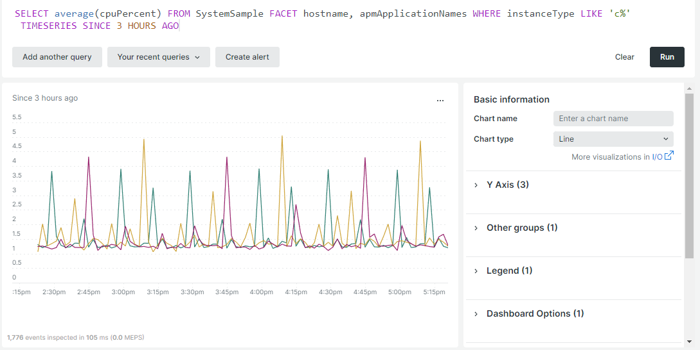

# 自动缩放

自动缩放功能可自动向云基础架构添加或删除资源，以保持最佳性能和合理的成本。 Adobe为[!DNL Adobe Commerce on cloud infrastructure]项目提供两种类型的自动缩放：

- [水平自动缩放](#horizontal-auto-scaling) （仅适用于缩放的体系结构） — 为缩放的体系结构项目添加或删除Web服务器节点。
- [垂直自动缩放](#vertical-auto-scaling) （可用于标准Pro体系结构或缩放的体系结构） — 调整现有节点的CPU容量以适应需求的变化。


## 启用自动缩放

要启用或禁用[!DNL Adobe Commerce on cloud infrastructure]项目的水平或垂直自动缩放，请[提交Adobe Commerce支持票证](https://experienceleague.adobe.com/en/docs/support-resources/adobe-support-tools-guide/adobe-commerce-support/adobe-commerce-help-center-user-guide#submit-ticket)。 在票证中选择以下原因：

- **联系原因**：基础架构更改请求
- **Adobe Commerce基础架构联系原因**：其他基础架构更改请求

>[!IMPORTANT]
>
>自动缩放功能会捕获意外事件。 即使您启用了自动缩放，如果您预计即将发生事件，Adobe仍建议您继续[提交Adobe Commerce支持票证](https://experienceleague.adobe.com/en/docs/support-resources/adobe-support-tools-guide/adobe-commerce-support/adobe-commerce-help-center-user-guide#submit-ticket)。

### 负载测试

Adobe首先在云项目&#x200B;_暂存_&#x200B;群集上启用自动缩放。 在环境中执行并完成负载测试后，Adobe会在生产群集上启用自动缩放。 有关负载测试的指导，请参阅[性能测试](../launch/checklist.md#performance-testing)。

## 水平自动缩放

目前，此功能仅适用于配置了[缩放体系结构](scaled-architecture.md)的项目。

水平自动缩放可为缩放的架构项目添加或删除Web服务器节点。 或者，[垂直自动缩放](#vertical-auto-scaling)可调整现有节点的CPU容量以适应需求的变化。

### Web服务器节点

[Web层](scaled-architecture.md#web-tier)可以扩展以适应进程请求的增加和更高的流量要求。 目前，自动缩放功能只能通过添加或删除Web服务器节点来水平缩放。

当CPU使用情况和流量达到预定义的阈值时，会发生自动缩放事件：

- 已添加&#x200B;**个节点** — 所有活动Web节点的CPU/核心在1分钟内都以75%的容量运行，流量在连续5分钟内增加20%。
- **节点已移除** — 所有活动Web节点上的CPU/核心以60%的加载速度加载20分钟。 节点会按照其添加顺序进行删除。

最小和最大阈值根据每个商户的合同资源限制确定和设置；这降低了无限扩展的风险。

### 使用New Relic监控阈值

您可以使用[New Relic服务](../monitor/new-relic-service.md)来监视某些阈值，如主机数和CPU使用情况。 以下New Relic查询对`cluster-id`使用变量表示法仅用于示例目的。

>[!TIP]
>
>有关生成查询的参考，请参阅&#x200B;_New Relic_&#x200B;文档中的[NRQL语法、子句和函数](https://docs.newrelic.com/docs/query-your-data/nrql-new-relic-query-language/get-started/nrql-syntax-clauses-functions/)。
>使用查询构建[New Relic仪表板](https://docs.newrelic.com/docs/query-your-data/explore-query-data/dashboards/introduction-dashboards/)。

#### 主机计数

以下示例New Relic查询显示环境中的主机计数：

```sql
SELECT uniqueCount(SystemSample.entityId) AS 'Infrastructure hosts', uniqueCount(Transaction.host) AS 'APM hosts seen' FROM SystemSample, Transaction where (Transaction.appName = 'cluster-id_stg' AND Transaction.transactionType = 'Web') OR SystemSample.apmApplicationNames LIKE '%|cluster-id_stg|%' TIMESERIES SINCE 3 HOURS AGO
```

在以下屏幕截图中，**看到的APM主机**&#x200B;是指在选定期间记录事务的主机数。


#### CPU使用情况

以下示例New Relic查询显示了CPU在Web节点的使用情况：

```sql
SELECT average(cpuPercent) FROM SystemSample FACET hostname, apmApplicationNames WHERE instanceType LIKE 'c%' TIMESERIES SINCE 3 HOURS AGO
```



### IP允许列表

启用自动缩放后，出站Web节点流量源自服务节点的IP地址。 如果您使用的允许列表与云基础架构项目上的Adobe Commerce未捆绑的第三方服务一起使用，请验证第三方服务中的IP地址。

例如：

- 如果允许列表包含服务节点（1、2和3）的IP地址，则无需执行任何操作。
- 如果允许列表包含服务节点（1、2和3）和Web节点（4、5和6）的IP地址（本例中是全部六个节点），则无需执行任何操作。
- 如果允许列表仅包含Web节点（4、5和6）的IP地址&#x200B;_仅_，则必须更新以包含服务节点的IP地址。

## 垂直自动缩放

除了传统的[水平自动缩放](#auto-scaling)之外，[!DNL Adobe Commerce on cloud infrastructure]还为标准专业架构和缩放的架构项目提供垂直自动缩放。

垂直自动缩放功能不会添加或删除节点，而是调整现有节点的CPU容量以适应需求的更改。 它是对水平自动缩放的补充，后者为缩放的架构项目添加或删除Web服务器节点。

- **节点已添加**：不适用。 垂直自动缩放可调整现有节点的大小，而不是添加新节点。
- **节点大小**：当内存压力超过定义的阈值时，节点将调整到下一个更大的实例大小。 每个缩放事件仅应用一次大小增加。
- **节点缩减**：在需求子集后，节点会自动缩减。 最小和最大大小是根据每个项目的使用模式和合同资源限制设置的，这降低了不必要扩展的风险。

### 自动缩放阈值

垂直自动缩放事件是使用Linux上的内存压力停滞信息(PSI)触发的，该信息测量系统由于内存压力而停滞的时间。 Adobe根据您项目的合同资源限制和使用模式设置阈值；商家当前无法配置这些阈值。

### 使用New Relic监控阈值

您可以使用[!DNL New Relic]服务监视基础结构实例详细信息，包括实例大小和类型。 在New Relic中配置警报，以便在垂直自动缩放事件更改实例的大小或类型时收到通知。

### 对您环境的影响

垂直自动缩放对您的环境有以下影响：

- **停机时间**：在调整节点大小时，预计不会出现停机时间。
- **计时**：调整节点大小通常需要20-30分钟。 在调整大小过程中，节点会暂时从负载平衡器中消失。
