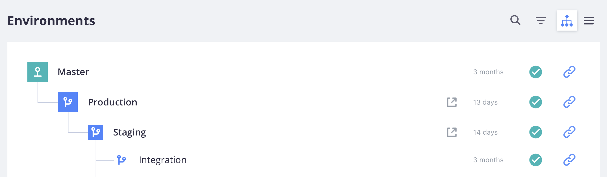

# Pro项目工作流

Pro项目包含一个具有全局`master`分支和三个主要环境的Git存储库：

1. 用于启动和维护实时站点的&#x200B;**生产**&#x200B;环境
1. **暂存**&#x200B;环境，用于测试所有服务
1. 用于开发和测试的&#x200B;**集成**&#x200B;环境



这些环境是`read-only`，仅接受从本地工作区推送的分支部署的代码更改。

下图演示了Pro开发和部署工作流，该工作流使用简单的Git分支方法。 您[使用基于](#development-workflow)环境的活动分支来开发`integration`代码，_正在推送_&#x200B;和&#x200B;_正在提取_&#x200B;代码更改到您的远程活动分支，或者从您的远程活动分支获取更改。 您通过&#x200B;_将远程分支_&#x200B;合并到基础分支来部署已验证的代码，这将为该环境激活自动[生成和部署](#deployment-workflow)进程。


由于环境是只读的，因此您无法直接在云环境中进行任何代码更改。 如果您尝试运行`composer install`以安装任何模块，则会收到错误，例如：

```bash
file_put_contents(...): Failed to open stream: Read-only file system  
The disk hosting /app/<cluster_ID> is full
```

有关详细信息，请参阅[Pro体系结构](pro-architecture.md)以了解Pro环境的概述，请参阅[[!DNL Cloud Console]](../project/overview.md#cloud-console)以了解Pro环境列表在项目视图中的概述。

## 开发工作流

集成环境提供了一个基础`integration`分支，其中包含您的Adobe Commerce on cloud基础架构代码。 您可以创建一个额外的活动环境分支。 这允许将最多两个活动分支部署到Platform as a Service (PaaS)容器。 不活动环境的数量没有限制，但是，不活动环境的数量越多，加载Cloud Console所需的时间就越长。

{{enhanced-integration-envs}}

项目环境支持灵活、连续的集成过程。 首先，将`integration`分支克隆到本地项目文件夹。 创建一个或多个分支、开发新功能、配置更改、添加扩展和部署更新：

- **从**&#x200B;获取`integration`更改

- 来自&#x200B;**的**&#x200B;分支`integration`

- 在本地工作站上开发&#x200B;**代码，包括**&#x200B;更新[!DNL Composer]

- 将&#x200B;**推送**&#x200B;代码更改到远程并进行验证

- **将**&#x200B;合并到`integration`并进行测试

使用开发的代码分支和相应的配置文件，您的代码更改可以合并到`integration`分支以进行更全面的测试。 `integration`环境也最适合：

- **集成第三方服务** — 并非所有服务在PaaS环境中都可用。

- **正在生成配置管理文件** — 在已部署的环境中，某些配置设置是&#x200B;_只读_。

- **正在配置您的商店** — 您应该使用集成环境完全配置所有商店设置。 您可以在&#x200B;**中的**&#x200B;集成&#x200B;_环境视图上找到_&#x200B;存储管理员URL _[!DNL Cloud Console]_。

## 部署工作流

每次将代码从本地工作站推送到远程环境或将合并代码推送到环境分支时，构建和部署脚本都会生成新代码并将配置的服务配置到远程环境。

生成脚本操作：

- 目标环境中的站点在构建期间继续运行

- 在云基础架构修补程序和修补程序上检查并运行Adobe Commerce

- 使用生成和部署日志编译代码

- 检查配置管理，在此阶段进行静态内容部署

- 创建或使用未更改代码的概要，以加快进程

- 配置所有后端服务和应用程序

部署脚本操作：

- 将站点置于&#x200B;_维护_&#x200B;模式的目标环境中

- 如果在生成期间未完成，则部署静态内容

- 在云基础架构上安装或更新Adobe Commerce

- 为流量配置路由

在构建和部署过程后，您的商店将恢复为在线商店，并包含最新的代码更改和配置。 请参阅[部署进程](../deploy/process.md)。

### 合并到集成

通过将活动开发分支合并到基础`integration`分支中，合并所有已验证的代码更改。 在将更改提升到暂存环境之前，您可以在`integration`分支上测试所有更改。

### 合并到暂存环境

暂存是一种预生产环境，它提供尽可能接近生产环境的所有服务和设置。 始终将代码更改从`integration`环境推送到`staging`环境，以便对所有服务执行彻底的测试。 首次使用暂存环境时，必须配置服务，如[Fastly CDN](../cdn/fastly.md)和[New Relic](../monitor/new-relic-service.md)。 使用沙盒或测试凭据配置支付网关、运送、通知和其他重要服务。

最好彻底测试每项服务，验证您的性能测试工具，并以管理员和客户的身份执行UAT测试，直到您认为您的存储已准备好投入生产环境为止。 查看[部署您的商店](../deploy/staging-production.md)。

{{second-staging}}

### 合并到生产

在暂存环境中进行全面测试后，合并到生产环境并使用实时凭据进行全面测试。 一旦您启动生产站点，客户必须能够完成购买，管理员必须能够管理实时商店。 有关部署您的存储并上线的详细而清晰的演练，请参阅以下主题：

- [部署您的商店](../deploy/staging-production.md)
- [站点启动](../launch/overview.md)

### 合并到全局母版

始终将生产代码的副本推送到全局`master`，以防迫切需要在不中断服务的情况下调试生产环境。

请&#x200B;**不**&#x200B;从全局`master`创建分支。 使用`integration`分支为开发和修复创建新的活动分支。
