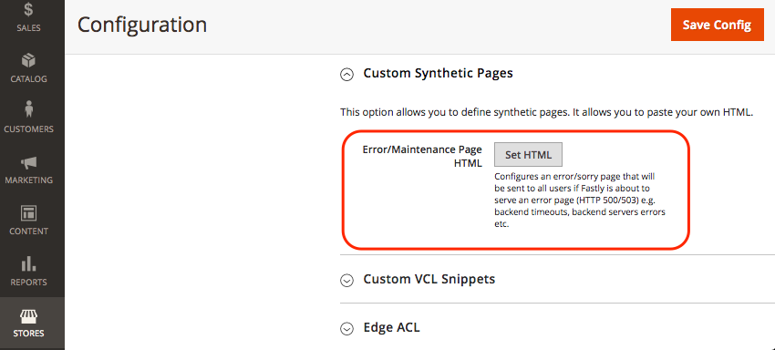

# Fastly故障诊断

使用以下信息对云基础架构项目环境中Adobe Commerce中Magento 2的Fastly CDN模块进行故障诊断和管理。 例如，您可以调查响应标头值和缓存行为以解决Fastly服务和性能问题。

在Pro生产和暂存环境中，您可以使用[New Relic日志](../monitor/log-management.md)查看和分析Fastly CDN和WAF日志数据，以排查错误和性能问题。

>[!NOTE]
>
>有关设置和配置Fastly的信息，请参阅[设置Fastly](fastly.md)。

## 找到Fastly服务ID

您需要Fastly服务ID才能从管理员配置Fastly或提交Fastly API请求以进行高级Fastly配置和故障排除。

如果您在项目环境中启用了Fastly，则可以从管理员处获取服务ID。 查看[获取Fastly凭据](fastly-configuration.md#get-fastly-credentials)。

开发人员和高级VCL用户可以使用自定义VCL使用Fastly变量`req.service_id`检索服务ID。 例如，您可以将`req.service_id`添加到VCL中的自定义日志记录指令以捕获服务ID值：

```json
log {"syslog"} req.service_id {" my_logging_endpoint_name :: "}
```

您可以对生产和暂存环境使用相同的VCL。 请参阅[`vcl_log`Fastly文档](https://www.fastly.com/documentation/reference/vcl/subroutines/log/)中的&#x200B;__。

## 站点性能、清除和缓存问题

使用以下列表可识别并解决与云基础架构环境中Adobe Commerce的Fastly服务配置相关的问题。

- **商店菜单不显示或不起作用** — 您可能使用了直接指向原始服务器的链接或临时链接，而不是使用实时站点URL，或者您在`-H "host:URL"`cURL命令[中使用了](#check-live-site-through-fastly)。 如果绕过Fastly到原始服务器，主菜单将不起作用，并且显示的标头不正确，这允许在浏览器端进行缓存。

- **顶部导航不起作用** — 顶部导航依赖于Edge Side Include (ESI)处理，该处理在您上传默认的Magento Fastly VCL代码片段时启用。 如果导航不起作用，[上传Fastly VCL](fastly-configuration.md#upload-vcl-to-fastly)并重新检查站点。

- **地理位置/地理IP不起作用** — 默认的Magento Fastly VCL代码段会将国家/地区代码附加到URL。 如果国家/地区代码不起作用，请[上传Fastly VCL](fastly-configuration.md#upload-vcl-to-fastly)并重新检查网站。

- **页面未缓存** — 默认情况下，Fastly不缓存标头为`Set-Cookies`的页面。 Adobe Commerce甚至在可缓存的页面上设置Cookie(TTL > 0)。 默认的Magento Fastly VCL会删除可缓存页面上的这些Cookie。 如果页面未缓存，请[上传Fastly VCL](fastly-configuration.md#upload-vcl-to-fastly)并重新检查站点。

  如果模板中的页面块被标记为不可缓存，也可能会发生此问题。 在这种情况下，问题很可能是由第三方模块或扩展阻止或删除Adobe Commerce标头导致的。 要解决此问题，请参阅[X-Cache仅包含MISS，没有HIT](#x-cache-contains-only-miss-no-hit)。

- **清除请求失败** — 当您提交清除请求时，Fastly返回以下错误：

  ```text
  The purge request was not processed successfully.
  ```

  此问题可能由以下任一问题引起：

   - 云基础架构项目环境上的Adobe Commerce的Fastly服务配置中的Fastly凭据无效
   - 自定义VCL代码片段中的代码无效

  要解决此问题，请参阅Adobe Commerce帮助中心的[清除Cloud上的Fastly缓存时出错](https://support.magento.com/hc/en-us/articles/115001853194-Error-purging-Fastly-cache-on-Cloud-The-purge-request-was-not-processed-successfully-)。

## 来自Fastly的503错误

如果Fastly返回503超时错误，请检查错误日志和503错误页面以确定根本原因。

>[!NOTE]
>
>如果在运行批量操作时发生超时，您可以[延长管理员的Fastly超时](fastly-custom-cache-configuration.md#extend-fastly-timeout)。

如果收到503错误，请检查生产或暂存环境错误日志和php访问日志以解决该问题。

**检查错误日志**：

- [错误日志](../test/log-locations.md#application-logs)

  ```text
  /var/log/platform/<project-ID>/error.log
  ```

  此日志包含来自应用程序或PHP引擎的任何错误，例如`memory_limit`或`max_execution_time exceeded`错误。 如果未发现任何与Fastly相关的错误，请检查PHP访问日志。

- PHP访问日志

  ```text
  /var/log/platform/<project-ID>/php.access.log
  ```

  在日志中搜索返回503错误的URL的HTTP 200响应。 如果找到200响应，则表示Adobe Commerce返回页面时没有出现错误。 这表示在超过Fastly服务配置中设置的`first_byte_timeout`值的间隔之后可能发生问题。

当发生503错误时，Fastly在错误和维护页面上返回原因。 如果您为[自定义响应页面](fastly-custom-response.md)添加了代码，则可能无法查看原因。 要查看默认错误页面上的原因代码，您可以删除自定义错误页面的HTML代码。

**检查Fastly 503错误页**：

{{admin-login-step}}

1. 单击&#x200B;**存储** > **设置** > **配置** > **高级** > **系统**。

1. 在右窗格中，展开&#x200B;**全页缓存**。

1. 在&#x200B;**Fastly配置**&#x200B;部分中，展开&#x200B;**自定义合成页面**，如下图所示。

   

1. 单击&#x200B;**设置HTML**。

1. 删除自定义代码。 您可以将其保存在文本程序中，以便稍后添加回来。

1. 单击&#x200B;**上传**&#x200B;将您的更新发送给Fastly。

1. 单击页面顶部的&#x200B;**保存配置**。

1. 重新打开导致503错误的URL。 Fastly返回一个错误页面，其原因如以下示例所示。

   

## Apex和子域已与Fastly帐户关联

如果云基础架构项目上的Adobe Commerce的Apex域和子域已与一个分配了服务ID的现有Fastly帐户关联，则在更新Fastly配置之前，您无法启动：

- 更新现有Fastly帐户上的Apex和子域配置。 查看[多个Fastly帐户和分配的域](fastly.md#multiple-fastly-accounts-and-assigned-domains)。

- [启用并配置Fastly](fastly-configuration.md#enable-fastly-caching)并完成[DNS配置](../launch/checklist.md#update-dns-configuration-with-production-settings)

## 验证或调试Fastly服务

您可以通过测试站点URL并检查响应中返回的标头值来排除云基础架构站点上Adobe Commerce的性能或缓存问题。

### 通过Fastly查看实时网站

使用Fastly API检查从实时站点返回的`Fastly-Magento-VCL-Uploaded`和`X-Cache`响应标头。

Fastly API请求通过Fastly扩展传递，以从源服务器获取响应。 如果响应返回不正确的标头，请直接测试[原始服务器](#bypass-fastly-cache-to-check-adobe-commerce-sites)。

**检查响应标头**：

1. 在终端中，使用以下`curl`命令测试您的实时网站URL：

   ```bash
   curl https://<live URL> -vo /dev/null -H Fastly-Debug:1
   ```

   如果尚未设置静态路由或完成实时站点上域的DNS配置，请使用`--resolve`标志，该标志绕过DNS名称解析。

   ```bash
   curl -svo /dev/null --resolve '<your_hostname>:443:<IP-address-of-cache-node>' <https-URL>
   ```

   >[!NOTE]
   >
   >要将此命令与`--resolve`选项一起使用，您必须通过SSL/TLS证书启用Fastly的TLS并查找缓存节点的IP地址。

1. 在响应中，验证[标头](#check-cache-hit-and-miss-response-headers)以确保Fastly正常工作。 您应在响应中看到以下唯一标头：

   ```http
   < Fastly-Magento-VCL-Uploaded: 1.2.222
   < X-Cache: HIT, MISS
   ```

如果标头没有正确的值，请参阅以下信息：

- [检查VCL上载](#fastly-vcl-has-not-been-uploaded)

- [X-Cache只包含MISS，没有HIT](#x-cache-contains-only-miss-no-hit)

### 绕过Fastly缓存检查Adobe Commerce站点

如果Fastly服务返回错误的标头，您可以创建一个VCL代码片段，该代码片段允许您提交绕过Fastly缓存的请求。 请参阅[绕过Fastly缓存](fastly-vcl-bypass-to-origin.md)。

添加VCL代码段后，使用cURL命令将请求从指定的IP地址提交到原始服务器。 然后，检查响应中是否有错误。

### 检查缓存命中和未命中响应标头

验证返回的响应是否包含以下信息：

- 包含`X-Magento-Tags`标头

- `Fastly-Module-Enabled`标头的值为`Yes`或在项目环境中安装的CDN Magento 2模块的Fastly的版本号

- [Cache-Control： max-age](https://www.w3.org/Protocols/rfc2616/rfc2616-sec14.html#sec14.9)大于0

- [Pragma](https://www.w3.org/Protocols/rfc2616/rfc2616-sec14.html#sec14.32)设置是`cache`

以下cURL命令输出摘录显示`Pragma`、`X-Magento-Tags`和`Fastly-Module-Enabled`标头的正确值：

```
* STATE: INIT => CONNECT handle 0x600057800; line 1402 (connection #-5000)
* Rebuilt URL to: https://www.mymagento.biz.c.sv7gVom4qrpek.ent.magento.cloud/
* Added connection 0. The cache now contains 1 members
* Trying 192.0.2.31...
* STATE: CONNECT => WAITCONNECT handle 0x600057800; line 1455 (connection #0)

% Total    % Received % Xferd  Average Speed   Time    Time     Time  Current
                                 Dload  Upload   Total   Spent    Left  Speed
0     0    0     0    0     0      0      0 --:--:-- --:--:-- --:--:--     0* Connected to www.mymagento.biz.c.sv7gVom4qrpek.ent.magento.cloud (54.229.163.31) port 443 (#0)

* STATE: WAITCONNECT => SENDPROTOCONNECT handle 0x600057800; line 1562 (connection #0)
  0     0    0     0    0     0      0      0 --:--:-- --:--:-- --:--:--     0* ALPN, offering h2

... portion omitted for brevity ...

< Set-Cookie: mage-messages=%5B%5D; expires=Wed, 22-Nov-2017 17:39:58 GMT; Max-Age=31536000; path=/
< Pragma: cache
< Expires: Wed, 23 Nov 2016 17:39:56 GMT
< Cache-Control: max-age=86400, public, s-maxage=86400, stale-if-error=5, stale-while-revalidate=5
< X-Magento-Tags: cb_welcome_popup store cb cb_store_info_mobile cb_header_promotional_bar cb_store_info cb_discount-promo-bar cpg_2 cb_83 cb_81 cb_84 cb_85 cb_86 cb_87 cb_88 cb_89 p5646 catalog_product p5915 p6040 p6197 p6227 p7095 p6109 p6122 p6331 p7592 p7651 p7690
< Fastly-Module-Enabled: yes
< Strict-Transport-Security: max-age=31536000
    < Content-Security-Policy: upgrade-insecure-requests
    < X-Content-Type-Options: nosniff
    < X-XSS-Protection: 1; mode=block
    < X-Frame-Options: SAMEORIGIN
    < X-Platform-Server: i-dff64b52
    <
    * STATE: PERFORM => DONE handle 0x600057800; line 1955 (connection #0)
    * multi_done
      0     0    0     0    0     0      0      0 --:--:--  0:00:02 --:--:--     0
    * Connection #0 to host www.mymagento.biz.c.sv7gVom4qrpek.ent.magento.cloud left intact
```

>[!NOTE]
>
>有关命中和未命中的详细信息，请参阅Fastly文档中的[了解具有屏蔽服务的缓存命中和未命中的标头](https://docs.fastly.com/guides/performance-tuning/understanding-cache-hit-and-miss-headers-with-shielded-services)。

### 解决在响应标头中发现的错误

此部分提供有关解决在使用Fastly API检查响应标头时返回的错误的建议。

#### 未启用Fastly模块

如果未启用Fastly模块(`Fastly-Module-Enabled: no`)或缺少标头，[请使用SSH登录](../development/secure-connections.md#connect-to-a-remote-environment)项目。 然后，运行以下命令以检查模块状态。

```bash
php bin/magento module:status Fastly_Cdn
```

根据返回的状态，使用以下说明更新Fastly配置。

- `Module does not exist` — 如果该模块不存在，[请在集成分支中安装和配置](https://github.com/fastly/fastly-magento2/blob/master/Documentation/INSTALLATION.md)适用于Magento 2的Fastly CDN模块。 安装完成后，启用并配置模块。 查看[设置Fastly](fastly-configuration.md)。

- `Module is disabled` — 如果Fastly模块被禁用，请更新本地环境中`integration`分支上的环境配置以启用它。 然后，将更改推送到暂存和生产环境。 请参阅[管理扩展](../store/extensions.md#install-an-extension)。

  如果您使用[配置管理](../store/store-settings.md#configure-store)，请先检查`app/etc/config.php`配置文件中的Fastly CDN模块状态，然后再将更改推送到生产或暂存环境。

  如果未在`Fastly_CDN => 0`文件中启用该模块(`config.php`)，请删除该文件并运行以下命令以使用最新的配置设置更新`config.php`。

  ```bash
  bin/magento magento-cloud:scd-dump
  ```

#### Fastly VCL尚未上传

如果尚未上传Fastly VCL (`Fastly-Magento-VCL-Uploaded`： `false`)，请使用Admin中的&#x200B;*上传VCL*&#x200B;选项进行上传。 查看[上传Fastly VCL代码片段](fastly-configuration.md#upload-vcl-to-fastly)。

#### X-Cache只包含MISS，没有HIT

如果`X-Cache`标头包含`HIT` （`HIT, HIT`或`HIT, MISS`），则表示Fastly已成功返回缓存的内容。

如果`X-Cache`标头为`MISS, MISS`且不包含`HIT`，请再次运行`curl`命令以确保该页面最近未从缓存中清除。

如果获得相同的结果，请使用[`curl`命令](#check-live-site-through-fastly)并验证[响应标头](#check-cache-hit-and-miss-response-headers)：

- `Pragma`是`cache`
- `X-Magento-Tags`已存在
- `Cache-Control: max-age`大于0

如果问题仍然存在，则其他扩展可能会重置这些标头。 在暂存环境中重复以下过程，方法是禁用所有扩展并重新启用每个扩展，以确定哪个扩展正在重置标头。 确定导致问题的扩展后，必须在生产环境中禁用它。

**要识别重置响应标头的扩展，请执行以下操作：**

{{admin-login-step}}

1. 导航到&#x200B;**商店** > **设置** > **配置** > **高级** > **高级**。

1. 在右窗格的&#x200B;*禁用模块输出*&#x200B;部分中，查找并禁用所有扩展。

1. 单击&#x200B;**保存配置**。

1. 单击&#x200B;**系统** > **工具** > **缓存管理**。

1. 单击&#x200B;**刷新Magento缓存**。

1. 对每个扩展完成以下步骤，这可能会导致Fastly标头问题：

   - 一次启用一个扩展，保存配置并刷新Adobe Commerce缓存。

   - 运行[`curl`命令](#check-live-site-through-fastly)以验证[响应标头](#check-cache-hit-and-miss-response-headers)。

   对每个扩展重复此过程。 如果不再显示Fastly响应标头，则表明您已经发现了导致Fastly问题的扩展。

在识别正在重置Fastly标头的扩展后，请与扩展开发人员联系以获取其他帮助。 我们无法提供修复或更新以使第三方扩展与Fastly缓存配合使用。

## 回滚Fastly配置

如果自定义VCL代码片段更新或其他Fastly配置更改导致云基础架构网站上的Adobe Commerce中断或返回错误，请使用Fastly API [activate](https://docs.fastly.com/api/config#version_0b79ae1ba6aee61d64cc4d43fed1e0d5)命令回滚到早期的VCL版本。 您无法从Admin回滚VCL版本。

**要回滚VCL版本**：

1. 要获取服务的可用VCL版本列表，请运行以下命令

   ```bash
   curl -H "Fastly-Key: <FASTLY_API_TOKEN>" -H "Accept: application/json" https://api.fastly.com/service/<FASTLY_SERVICE_ID>/version
   ```

1. 运行以下命令将活动VCL版本更改为指定版本。

   ```bash
   curl -H "Fastly-Key: <FASTLY_API_TOKEN>" -H "Content-Type: application/x-www-form-urlencoded" -H "Accept: application/json" -X PUT https://api.fastly.com/service/<FASTLY_SERVICE_ID>/version/<VERSION_ID>/activate
   ```

有关使用Fastly API查看和管理VCL的详细信息，请参阅[使用API管理VCL](fastly-vcl-custom-snippets.md#manage-custom-vcl-snippets-using-the-api)。
