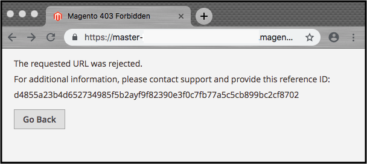

# Web应用程序防火墙(WAF)

由Fastly提供支持的Adobe Commerce云基础架构上的Web应用程序防火墙(WAF)服务可检测、记录并阻止恶意请求流量，以防其损害您的网站或网络。 WAF服务仅在生产环境中可用。

WAF服务提供以下优势：

- **PCI合规性**—WAF支持确保生产环境中的Adobe Commerce店面满足PCI DSS 6.6安全要求。
- **默认WAF策略** — 由Fastly配置和维护的默认WAF策略提供专为保护Adobe Commerce Web应用程序而设计的安全规则集合，这些安全规则包括注入攻击、恶意输入、跨站点脚本、数据导出、HTTP协议违规和其他[OWASP十大](https://owasp.org/www-project-top-ten/)安全威胁。
- **WAF载入和启用** —Adobe在最终配置后的2到3周内，在您的生产环境中部署并启用默认WAF策略。
- **操作和维护支持**—
   - Adobe和Fastly为WAF服务设置和管理日志、规则和警报。
   - Adobe会分类与WAF服务问题相关的客户支持工单，这些工单将阻止合法流量作为优先级1问题。
   - 自动升级到WAF服务版本可确保即时覆盖新的或正在演变的利用漏洞攻击。 请参阅[WAF维护和升级](#waf-maintenance-and-updates)。

>[!TIP]
>
>有关在云基础架构存储上维护Adobe Commerce的PCI合规性的其他信息，请参阅[PCI合规性](https://business.adobe.com/products/magento/pci-compliance.html)。

## 启用WAF

Adobe功能可在最终配置后的2至3周内，为新帐户启用WAF服务。 WAF通过Fastly CDN服务实施。 您无需安装或维护任何硬件或软件。

>[!NOTE]
>
>在使用WAF服务之前，您必须先通过Fastly服务路由到Adobe Commerce on cloud基础架构项目的所有外部流量。 查看[设置Fastly](fastly-configuration.md)。

## 工作原理

WAF服务与Fastly集成，并使用Fastly CDN服务中的缓存逻辑过滤Fastly全局节点的流量。 我们使用基于Trustwave SpiderLabs](https://github.com/owasp-modsecurity/ModSecurity)的[ModSecurity规则和WAF十大安全威胁的默认WAF策略，在您的生产环境中启用OWASP服务。

WAF服务会针对WAF规则集检查HTTP和HTTPS流量(GET和POST请求)，并阻止恶意流量或不遵守特定规则的流量。 该服务仅检查尝试刷新缓存的原点绑定流量。 因此，我们会在Fastly缓存中停止大多数攻击流量，从而保护原始流量免受恶意攻击。 通过仅处理源流量，WAF服务可保留缓存性能，并为每个非缓存请求仅引入约1.5毫秒到20毫秒的延迟。

## 疑难解答被阻止的请求

启用WAF服务后，它会根据WAF规则检查所有Web和管理员流量，并阻止触发规则的任何Web请求。 当请求被阻止时，请求者会看到一个默认的`403 Forbidden`错误页面，其中包含阻止事件的引用ID。

您可以从管理员自定义此错误响应页面。 请参阅[自定义WAF响应页面](fastly-custom-response.md#customize-the-waf-error-page)。

如果您的Adobe Commerce管理页面或店面在响应合法URL请求时返回`403 Forbidden`错误页面，请提交[Adobe Commerce支持票证](https://experienceleague.adobe.com/docs/commerce-knowledge-base/kb/help-center-guide/magento-help-center-user-guide.html#submit-ticket)。 复制错误响应页面中的引用ID，并将其粘贴到票证描述中。

要使用New Relic识别特定请求的WAF响应，请参阅以下内容：

- `Agent_response` — 指示WAF响应代码（`200`表示良好，`406`表示已阻止）
- `sigsci`标记 — 根据请求的性质将请求标记到特定的signal sciences标记

## WAF维护和更新

Fastly根据来自商业第三方、Fastly研究和公开来源的规则更新，更新并推出新CVE/模板化规则的补丁。 Fastly会根据需要或在可从各自来源对规则进行更改时将发布的规则更新为策略。 此外，Fastly可以在启用WAF服务后，将匹配已发布规则类的规则添加到任何服务的WAF实例中。 这些更新确保即时涵盖新的或不断演变的利用漏洞攻击。

在阻止模式下部署更新之前，Adobe和Fastly管理更新过程，以确保新的或修改的WAF规则在您的生产环境中有效工作。

## 问题

如果您发现WAF正在阻止合法请求，则这些请求通常是误报，需要绕过或在WAF服务中实施解决方法。 提交支持工单并包含受影响的URL、重现错误的准确步骤，以及文本形式的错误引用（与屏幕快照相反）以避免转录错误。

## 限制

由Fastly提供的标准WAF服务不支持以下功能：

- 防止恶意软件或机器人减轻 — 考虑使用[访问控制列表](./fastly-vcl-allowlist.md)或第三方服务。
- 速率限制 — 请参阅Fastly文档中的[速率限制](https://github.com/fastly/fastly-magento2/blob/master/Documentation/Guides/RATE-LIMITING.md)，或参阅&#x200B;_Commerce Web API_&#x200B;安全部分中的[速率限制](https://developer.adobe.com/commerce/webapi/get-started/rate-limiting/)。
- 配置客户的日志记录终结点 — 另请参阅[PrivateLink服务](../development/privatelink-service.md)。

WAF服务允许您根据IP地址阻止或允许流量。 您可以向Fastly服务添加访问控制列表(ACL)和自定义VCL片段，以指定用于阻止或允许流量的IP地址和VCL逻辑。 查看[自定义Fastly VCL片段](fastly-vcl-custom-snippets.md)。

WAF服务不支持筛选TCP、UDP或ICMP请求。 但是，此功能由Fastly CDN服务中包含的内置DDoS保护提供。 请参阅[DDoS保护](fastly.md#ddos-protection)。
