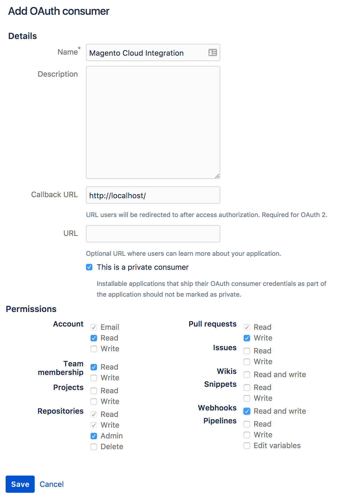

# 比特桶集成

您可以将Bitbucket存储库配置为在推送代码更改时自动构建和部署环境。 此集成会将您的Bitbucket存储库与Adobe Commerce在云基础架构帐户中同步。

{{private-repository}}

## 先决条件

- 对云基础架构项目上Adobe Commerce的管理员访问权限
- 本地环境中的[`magento-cloud` CLI](../dev-tools/cloud-cli-overview.md)工具
- Bitbucket帐户
- 具有比特桶存储库的管理员访问权限
- 比特桶存储库的SSH访问密钥

## 准备存储库

从现有环境克隆Adobe Commerce on cloud infrastructure项目，并将项目分支迁移到空的新比特桶存储库，保留相同的分支名称。 **关键是**&#x200B;要保留相同的Git树，以便您不会丢失云基础架构项目上的Adobe Commerce中的任何现有环境或分支。

1. 从终端，登录到您的Adobe Commerce on cloud infrastructure项目。

   ```bash
   magento-cloud login
   ```

1. 列出您的项目并复制项目ID。

   ```bash
   magento-cloud project:list
   ```

1. 将项目克隆到本地环境。

   ```bash
   magento-cloud project:get <project-ID>
   ```

1. 将您的Bitbucket存储库添加为远程存储库。

   ```bash
   git remote add origin git@bitbucket.org:<user-name>/<repo-name>.git
   ```

   远程连接的默认名称可以是`origin`或`magento`。 如果`origin`存在，则可以选择其他名称，也可以重命名或删除现有引用。 请参阅[git-remote文档](https://git-scm.com/docs/git-remote)。

1. 验证是否正确添加了Bitbucket远程。

   ```bash
   git remote -v
   ```

   预期响应：

   ```
   origin git@bitbucket.org:<user-name>/<repo-name>.git (fetch)
   origin git@bitbucket.org:<user-name>/<repo-name>.git (push)
   ```

1. 将项目文件推送至新的Bitbucket存储库。 请记住保持所有分支名称相同。

   ```bash
   git push -u origin master
   ```

   如果您从新的Bitbucket存储库开始，您可能需要使用`-f`选项，因为远程存储库与您的本地副本不匹配。

1. 验证Bitbucket存储库是否包含所有项目文件。

## 创建OAuth消费者

Bitbucket集成需要[OAuth使用者](https://support.atlassian.com/bitbucket-cloud/docs/use-oauth-on-bitbucket-cloud/)。 您需要此使用者的OAuth `key`和`secret`来完成下一节。

**要在Bitbucket**&#x200B;中创建OAuth使用者，请执行以下操作：

1. 登录到您的[Bitbucket](https://id.atlassian.com/login)帐户。

1. 单击&#x200B;**设置** > **访问管理** > **OAuth**。

1. 单击&#x200B;**添加消费者**&#x200B;并按如下方式对其进行配置：

   

   >[!WARNING]
   >
   >不需要有效的&#x200B;**回调URL**，但必须在此字段中输入值才能成功完成集成。

1. 单击&#x200B;**保存**。

1. 单击使用者&#x200B;**名称**&#x200B;以显示您的OAuth `key`和`secret`。

1. 复制您的OAuth `key`和`secret`以配置集成。

## 配置集成

1. 从终端，导航到您的Adobe Commerce on cloud基础架构项目。

1. 创建名为`bitbucket.json`的临时文件并添加以下内容，将尖括号中的变量替换为您的值：

   ```json
   {
     "type": "bitbucket",
     "repository": "<bitbucket-user-name/bitbucket-repo-name>",
     "app_credentials": {
       "key": "<oauth-consumer-key>",
       "secret": "<oauth-consumer-secret>"
     },
     "prune_branches": true,
     "fetch_branches": true,
     "build_pull_requests": true,
     "resync_pull_requests": true
   }
   ```

   >[!TIP]
   >
   >请确保使用Bitbucket存储库的名称，而不是URL。 如果您使用URL，则集成会失败。

1. 使用`magento-cloud` CLI工具将集成添加到您的项目中。

   >[!WARNING]
   >
   >以下命令使用Bitbucket存储库中的代码覆盖Adobe Commerce on cloud infrastructure项目中的&#x200B;_所有_&#x200B;代码。 这包括所有分支，包括`production`分支。 此操作立即发生且无法撤消。 作为最佳实践，在添加Bitbucket集成之前，请务必从Adobe Commerce on cloud infrastructure项目克隆所有分支，并将它们推送到Bitbucket存储库&#x200B;**。**

   ```bash
   magento-cloud project:curl -p '<project-ID>' /integrations -i -X POST -d "$(< bitbucket.json)"
   ```

   这会返回带有标头的长HTTP响应。 成功的集成会返回200或201状态代码。 状态400或更高表示出现错误。

1. 删除临时`bitbucket.json`文件。

1. 验证项目集成。

   ```bash
   magento-cloud integrations -p <project-ID>
   ```

   ```
   +----------+-----------+--------------------------------------------------------------------------------+
   | ID       | Type      | Summary                                                                        |
   +----------+-----------+--------------------------------------------------------------------------------+
   | <int-id> | bitbucket | Repository: bitbucket_Account/magento-int                                      |
   |          |           | Hook URL:                                                                      |
   |          |           | https://magento-url.cloud/api/projects/<project-id>/integrations/<int-id>/hook |
   +----------+-----------+--------------------------------------------------------------------------------+
   ```

   记下&#x200B;**挂接URL**&#x200B;以在BitBucket中配置webhook。

### 在BitBucket中添加webhook

要与Cloud Git服务器通信事件（例如推送），需要为BitBucket存储库具有webhook。 正确执行本页中详细介绍的设置Bitbucket集成的方法时，会自动创建webhook。 请务必验证webhook以避免创建多个集成。

1. 登录到您的[Bitbucket](https://id.atlassian.com/login)帐户。

1. 单击&#x200B;**存储库**&#x200B;并选择您的项目。

1. 单击&#x200B;**存储库设置** > **工作流** > **Webhooks**。

1. 在继续之前验证webhook。

   如果挂接处于活动状态，请跳过剩余步骤并[测试集成](#test-the-integration)。 挂接的名称应类似于&#x200B;**&quot;云基础架构上的Adobe Commerce &lt;project_id>&quot;**，挂接URL格式应类似于： `https://<zone>.magento.cloud/api/projects/<project_id>/integrations/<id>/hook`

1. 单击&#x200B;**添加webhook**。

1. 在&#x200B;_添加新webhook_&#x200B;视图中，编辑以下字段：

   - **标题**： Adobe Commerce集成
   - **URL**：使用您`magento-cloud`集成列表中的挂接URL
   - **触发器**：默认为基本&#x200B;_存储库推送_

1. 单击&#x200B;**保存**。

### 测试集成

配置Bitbucket集成后，您可以使用`magento-cloud` CLI验证集成是否可正常工作：

```bash
magento-cloud integration:validate
```

或者，您也可以通过将简单的更改推送到Bitbucket存储库来进行测试。

1. 创建测试文件。

   ```bash
   touch test.md
   ```

1. 提交更改并将其推送到您的Bitbucket存储库。

   ```bash
   git add . && git commit -m "Testing Bitbucket integration" && git push
   ```

1. 登录到[[!DNL Cloud Console]](../project/overview.md)并验证是否显示提交消息以及是否部署项目。

   

## 创建云分支

Bitbucket集成无法在Adobe Commerce on cloud基础架构项目中激活新环境。 如果您使用Bitbucket创建环境，则必须手动激活该环境。 为避免此额外步骤，最佳做法是使用`magento-cloud` CLI工具或[!DNL Cloud Console]创建环境。

**要激活使用Bitbucket**&#x200B;创建的分支，请执行以下操作：

1. 使用`magento-cloud` CLI推送分支。

   ```bash
   magento-cloud environment:push from-bitbucket
   ```

   ```
   Pushing from-bitbucket to the new environment from-bitbucket
   Activate from-bitbucket after pushing? [Y/n] y
   Parent environment [master]: integration
   --- (Validation and activation messages)
   ```

1. 验证环境是否处于活动状态。

   ```bash
   magento-cloud environment:list
   ```

   ```
   Your environments are:
   +---------------------+----------------+--------+
   | ID                  | Name           | Status |
   +---------------------+----------------+--------+
   | master              | Master         | Active |
   |  integration        | integration    | Active |
   |    from-bitbucket * | from-bitbucket | Active |
   +---------------------+----------------+--------+
   * - Indicates the current environment
   ```

创建环境后，您可以使用常规Git命令将相应的分支推送到远程Bitbucket存储库。 对您在Bitbucket中的分支所做的后续更改会自动构建和部署环境。

## 删除集成

您可以安全地从项目中移除Bitbucket集成，而不会影响您的代码。

**要删除Bitbucket集成**：

1. 从终端，登录到您的Adobe Commerce on cloud infrastructure项目。

1. 列出您的集成。 您需要Bitbucket集成ID才能完成下一步。

   ```bash
   magento-cloud integration:list
   ```

1. 删除集成。

   ```bash
   magento-cloud integration:delete <int-ID>
   ```

此外，您可以通过登录到Bitbucket帐户并撤销帐户&#x200B;_设置_&#x200B;页面上的OAuth授权来删除Bitbucket集成。

## Bitbucket服务器集成

要使用Bitbucket服务器集成，您需要满足以下条件：

- [比特段访问令牌](https://confluence.atlassian.com/bitbucketserver/http-access-tokens-939515499.html) — 生成一个令牌，授予项目`read`的访问权限和存储库`admin`的访问权限
- [Bitbucket服务器URL](https://confluence.atlassian.com/bitbucketserver/specify-the-bitbucket-base-url-776640392.html) — 添加Bitbucket实例的基本URL

虽然您可以使用Cloud CLI来完成Bitbucket服务器集成步骤，但完整的命令如下所示：

```bash
magento-cloud integration:add --type=bitbucket_server --base-url=<bitbucket-url> --username=<username> --token=<bitbucket-access-token> --project=<project-ID>
```

使用help命令了解更多使用要求和选项： `magento-cloud integration:add --help`
