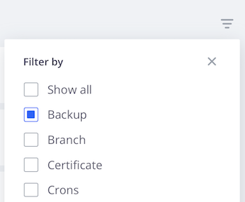

# 活动流

每个环境的主视图会显示一个与Git日志类似的&#x200B;**活动**&#x200B;历史事件列表。 活动列表是活动环境的最近事件的流。 以下是显示在活动流中的活动类型及其图标列表：

{width="500" align="center"}

## 查看日志

在活动列表中，单击活动的状态图标以查看日志。 或者，单击{width="32"} （_更多_）菜单以访问更多用于管理活动的选项。 下面显示了创建备份的简短日志。 您可以[使用Cloud CLI](#activity-stream-with-cloud-cli)查看同一日志。


## 管理活动

某些活动处于&#x200B;_正在运行_&#x200B;或&#x200B;_挂起_&#x200B;状态。 您可以对正在运行的活动执行操作，例如取消正在运行的部署。 以下选项卡显示了取消活动的两种方法：[!DNL Cloud Console]或Cloud CLI。

>[!BEGINTABS]

>[!TAB 控制台]

**要取消[!DNL Cloud Console]**&#x200B;中的活动，请执行以下操作：

通过访问{width="32"} （_更多_）菜单并选择操作（如`Cancel`或`View log`），您可以对正在运行的活动执行操作。 对于此示例，请选择&#x200B;**取消**&#x200B;选项以停止正在运行的活动。

并非所有活动都有取消选项。 例如，取消应用程序部署的选项仅在&#x200B;_生成_&#x200B;阶段显示。 一旦应用程序进入&#x200B;_部署_&#x200B;阶段，您就无法再取消该活动。 有关不同阶段，请参阅[部署进程](../deploy/process.md)。

{width="450" align="center"}

如果某个终端运行部署活动，则在[!DNL Cloud Console]中取消会导致该终端中的取消：

{width="300"}取消

>[!TAB CLI]

**要在Cloud CLI中取消活动**，请执行以下操作：

1. 识别正在运行的活动并选择活动ID。

   ```bash
   magento-cloud activity:list --state=in_progress
   ```

1. 使用活动ID取消活动：

   ```bash
   magento-cloud activity:cancel wvl5wm7s5vkhy
   ```

>[!ENDTABS]

## 筛选活动流

当您查找特定的内容（如备份或合并事件）时，过滤活动列表的功能非常有用。

**要在[!DNL Cloud Console]**&#x200B;中筛选活动列表，请执行以下操作：

1. 选择一个环境，然后选择“活动&#x200B;**[!UICONTROL All]**”视图以包含完整的事件历史记录。

1. 单击{width="32"}并选择&#x200B;**[!UICONTROL Filter by]**&#x200B;选项：

   

1. 选择活动&#x200B;**[!UICONTROL Recent]**&#x200B;视图并重置列表。

## 使用Cloud CLI查看流

`magento-cloud` CLI提供了与[!DNL Cloud Console]相同的大部分功能。 `activity`命令可以：

- `list`环境的活动流
- 有关特定活动的`get`详细信息
- 显示特定活动的`log`
- `cancel`活动

**使用Cloud CLI查看活动流**：

1. 列出当前环境的活动。

   ```bash
   magento-cloud activity:list
   ```

1. 每个活动都有一个唯一的ID。 从之前的列表中选择ID并查看该活动的详细信息。

   ```bash
   magento-cloud activity:get wvl5wm7s5vkhy
   ```

1. 查看该活动的完整日志。

   ```bash
   magento-cloud activity:log wvl5wm7s5vkhy
   ```

   示例响应：

   ```bash
   Activity ID: wvl5wm7s5vkhy
   Type: environment.backup
   Description: User created a backup of Master
   Created: 2023-09-08T14:03:33+00:00
   State: complete
   Log:
   Creating backup of master
   Created backup eg5pu63egt2dcojkljalzjdopa
   ```
